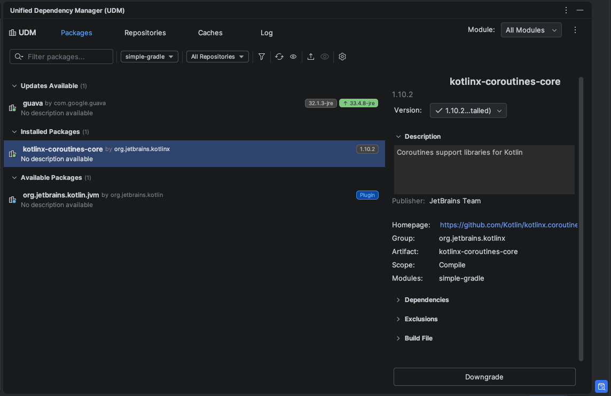
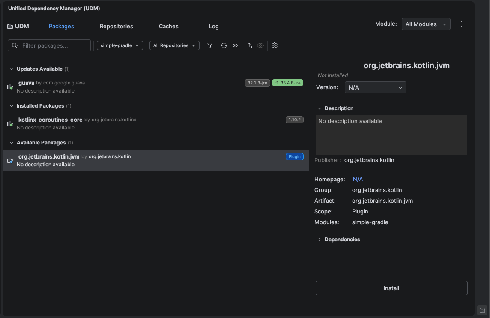
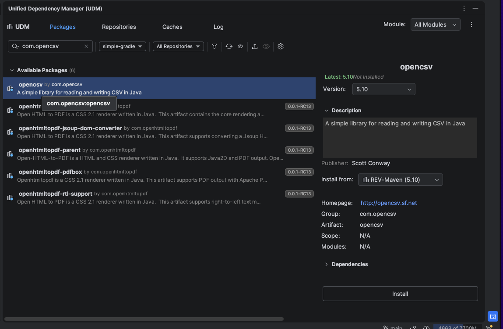
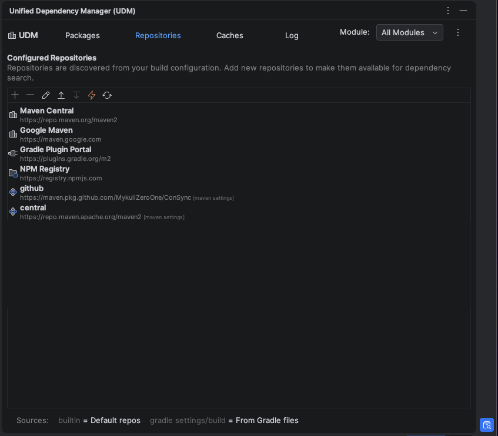
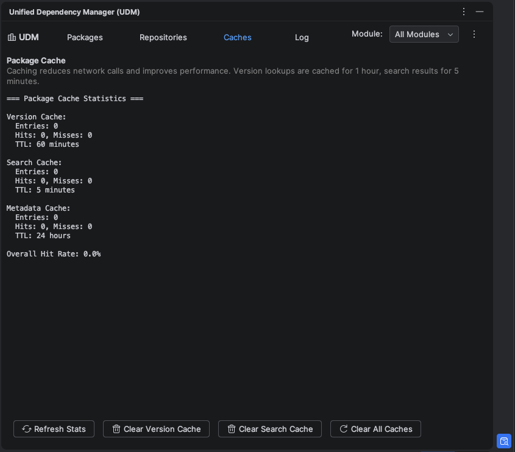

    

<h1 align="center">Unified Dependency Manager (UDM)</h1>

<b>NuGet-style dependency management for IntelliJ IDEA</b> Search, install, update, and secure your dependencies across Maven, Gradle, and NPM &mdash; without leaving your IDE.

 

<!-- Plugin description -->

**The dependency manager IntelliJ has been missing.** If you've ever wished for a NuGet-style package manager inside your JetBrains IDE, UDM is built for you.

Stop juggling browser tabs, copy-pasting coordinates, and hand-editing build files. UDM gives you a single tool window to **search, install, update, and remove** dependencies across five package ecosystems &mdash; with preview diffs, vulnerability scanning, and one-click bulk upgrades.

---

### Why UDM?

* **See everything at a glance** &mdash; Installed packages show current version alongside the latest available, color-coded so outdated dependencies jump out instantly.
* **Update with confidence** &mdash; Every build file change shows a preview diff before it's applied. No surprises, full undo support.
* **Five ecosystems, one window** &mdash; Maven Central, local Maven repos, Nexus/Artifactory, Gradle Plugin Portal, and NPM. Search them all from one place.
* **Stay secure** &mdash; Vulnerability scanning powered by the GitHub Advisory Database flags known CVEs in your dependency tree.
* **Multi-module aware** &mdash; Scans every module in your project and tracks exactly which build file owns each dependency.

---

### Core Features (Free)

* **Installed Packages view** &mdash; Browse all dependencies across all modules with version badges, update indicators, and filtering.
* **Maven Central search** &mdash; Search by artifact, group, or `group:artifact`. Double-click to copy a ready-to-use Gradle or Maven declaration.
* **Local Maven repository browser** &mdash; Explore `~/.m2/repository` and copy coordinates instantly.
* **Nexus &amp; Artifactory** &mdash; Connect to private repositories and search your organization's internal artifacts.
* **Gradle Plugin Portal** &mdash; Search plugins by keyword or tag.
* **NPM Registry** &mdash; Search npm packages and copy install commands for npm, yarn, or pnpm.
* **Repository discovery** &mdash; Automatically detects repositories from your `settings.gradle`, `build.gradle`, `pom.xml`, and Maven `settings.xml` &mdash; including credentials.
* **One-click updates** &mdash; Select a dependency, pick a version, preview the diff, and apply.

### Premium Features

* **Bulk upgrade** &mdash; Update all outdated dependencies in a single operation.
* **Version consolidation** &mdash; Find packages with inconsistent versions across modules and unify them in one step.
* **Vulnerability scanning** &mdash; Scan your dependency tree against the GitHub Advisory Database and see severity-ranked results.
* **Exclusion suggestions** &mdash; Automatically detect transitive dependency conflicts and known-problematic libraries, with one-click exclusion management.

---

### Getting Started

1. Install UDM from the **JetBrains Marketplace** (or from a ZIP via Settings > Plugins > Install Plugin from Disk).
2. Open the **Unified Dependency Manager** tool window from the bottom panel.
3. You'll see your installed packages immediately. Search, update, or explore from there.

Works with **IntelliJ IDEA 2024.2+** (Community and Ultimate).

<!-- Plugin description end -->

---

## Screenshots

### Installed Packages &mdash; Everything at a Glance

See all your dependencies with version badges, update indicators, and a detail panel showing description, publisher, homepage, scope, and module. Outdated packages are grouped under "Updates Available" so they stand out immediately.

### Install New Packages &mdash; One Click

Browse available packages, view metadata, and install directly into your build file. No copy-pasting coordinates.

### Search Across All Repositories

Search Maven Central, Nexus, Artifactory, or any configured repository. Results show version, description, and publisher &mdash; select a package to see full details and install from the repository of your choice.

### Auto-Discovered Repositories

UDM reads your `settings.gradle`, `build.gradle`, `pom.xml`, and Maven `settings.xml` to discover every configured repository &mdash; including private ones with credentials.

### Add Repositories &mdash; Save Anywhere

Add new repositories and choose where to persist them: Gradle build files, Maven global settings, or plugin-only.

### Built-In Cache Management

Monitor cache hit rates and clear version, search, or metadata caches independently. Caching reduces network calls and keeps the UI responsive.

---

## Installation

**From JetBrains Marketplace** (recommended):

> Open **Settings > Plugins > Marketplace**, search for "Unified Dependency Manager", and click **Install**.

**From GitHub Releases**:

> Download the ZIP from the [Releases](https://github.com/maddrobot/udm/releases) page and install via **Settings > Plugins > Install Plugin from Disk**.

## Compatibility

| IDE | Supported Versions |
|-----|-------------------|
| IntelliJ IDEA (Community & Ultimate) | 2024.2 &ndash; 2025.3+ |

Requires bundled plugins: Java, Gradle, Kotlin, and Groovy.

## Changelog

See [CHANGELOG.md](CHANGELOG.md) for release history.

## License

See [LICENSE](LICENSE) for details.

## Links

- **JetBrains Marketplace**: *Coming soon*
- **GitHub**: https://github.com/maddrobot/udm
- **Issues**: https://github.com/maddrobot/udm/issues
- **Releases**: https://github.com/maddrobot/udm/releases
