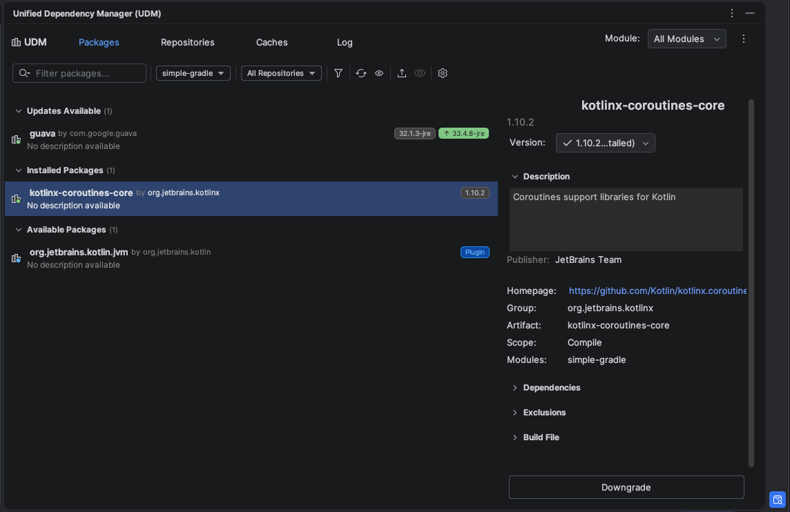
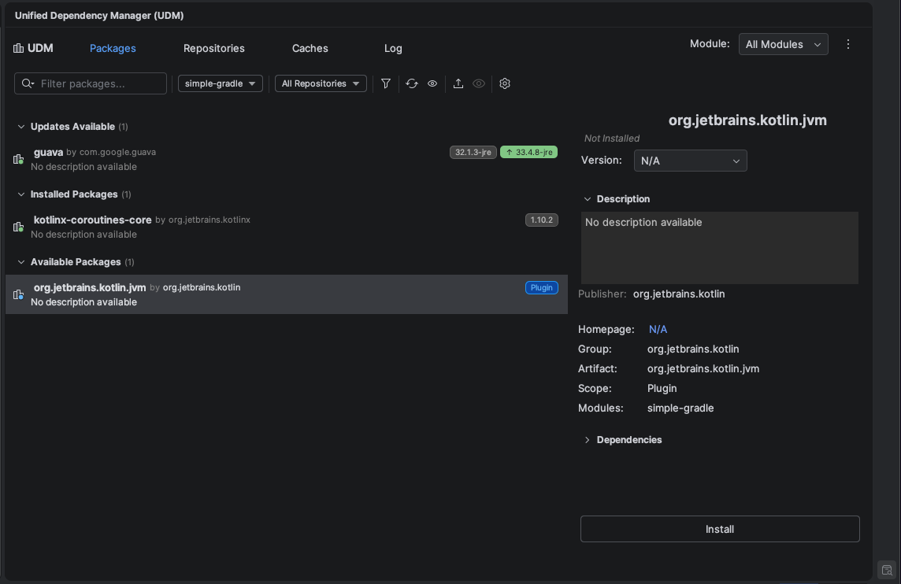
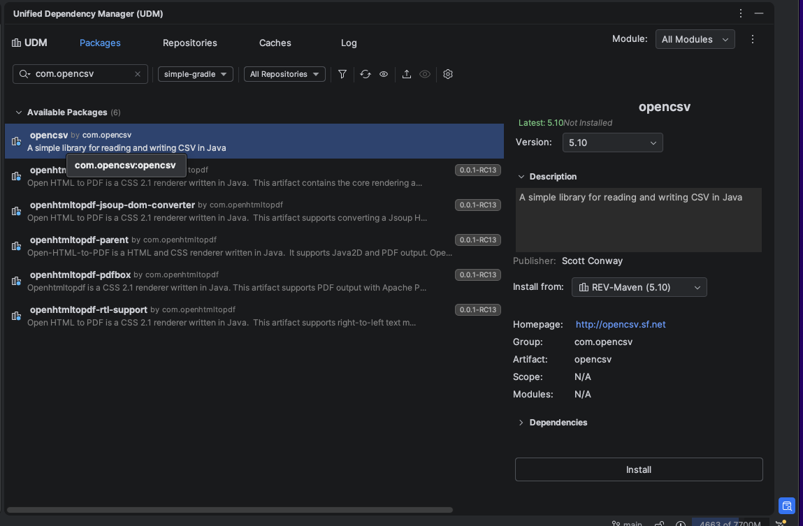
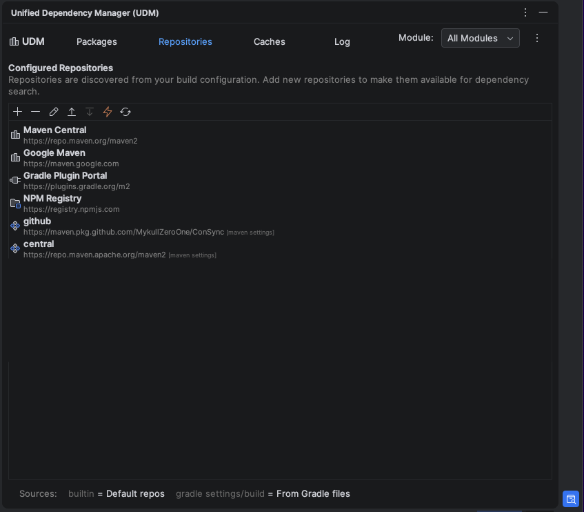
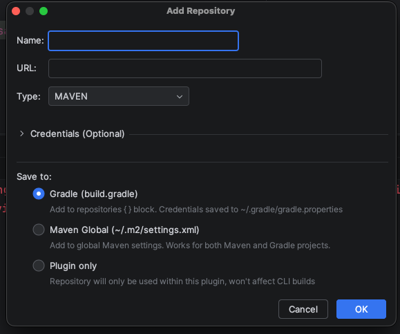
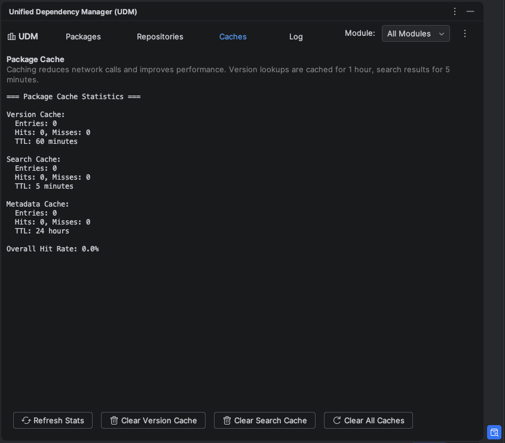

    

<h1 align="center">Unified Dependency Manager (UDM)</h1>

<b>NuGet-style dependency management for IntelliJ IDEA</b> Search, install, update, and secure your dependencies across Maven, Gradle, and NPM &mdash; without leaving your IDE.

 

<!-- Plugin description -->

**Unified dependency management inside IntelliJ.** If you’ve wanted a NuGet‑style workflow in a JetBrains IDE, UDM delivers it with a single, fast tool window.

Stop juggling browser tabs and build files. UDM lets you **search, install, update, and secure** dependencies across Maven, Gradle, and NPM with preview diffs, version insights, and bulk actions.

---

### Why teams pick UDM

* **Instant clarity** — Installed packages show current vs. latest versions at a glance, with grouped updates and vulnerability flags.
* **Safe changes** — Every operation previews the diff before it touches your build files.
* **One window for five ecosystems** — Maven Central, local Maven, Nexus/Artifactory, Gradle Plugin Portal, and NPM.
* **Security‑aware** — CVE scanning highlights vulnerable transitive dependencies and suggests safe exclusions.
* **Multi‑module accuracy** — UDM tracks the exact build file and configuration that owns each dependency.

---

### Core Features (Free)

* **Unified Packages view** — Browse installed, transitive, update‑ready, and available packages together.
* **Fast search** — Find packages by keyword or `group:artifact`, then copy or install with one click.
* **Repository discovery** — Detects repositories from Gradle, Maven, and settings files, including credentials.
* **Repo management** — Add, test, and persist repositories to Gradle, Maven settings, or plugin‑only.
* **Cache insights** — Track cache health and clear version/search/metadata caches independently.

### Premium Features

* **Bulk upgrade** — Update all outdated dependencies at once.
* **Version consolidation** — Align versions across modules in one step.
* **Vulnerability scanning** — CVE detection with severity ranking.
* **Exclusion suggestions** — One‑click fixes for transitive conflicts and known problematic libraries.

---

### Getting Started

1. Install UDM from the **JetBrains Marketplace** (or from a ZIP via Settings > Plugins > Install Plugin from Disk).
2. Open the **Unified Dependency Manager** tool window from the bottom panel.
3. You’ll see your installed packages immediately. Search, update, or explore from there.

Works with **IntelliJ IDEA 2024.2+** (Community and Ultimate).

<!-- Plugin description end -->

---

## Screenshots

### Installed Packages &mdash; Everything at a Glance

See installed, transitive, and update‑ready packages together, with clear badges and details for each dependency.

### Search and Install

Find packages quickly, view metadata, and install directly into your build file without copy‑pasting.

### Search Across Repositories

Search Maven Central, Nexus, Artifactory, or any configured repository. Results show version, description, and publisher.

### Auto‑Discovered Repositories

UDM reads your `settings.gradle`, `build.gradle`, `pom.xml`, and Maven `settings.xml` to discover configured repositories.

### Add Repositories &mdash; Save Anywhere

Add new repositories and choose where to persist them: Gradle build files, Maven settings, or plugin‑only.

### Built‑In Cache Management

Monitor cache health and clear version, search, or metadata caches independently.

---

## Installation

**From JetBrains Marketplace** (recommended):

> Open **Settings > Plugins > Marketplace**, search for "Unified Dependency Manager", and click **Install**.

**From GitHub Releases**:

> Download the ZIP from the [Releases](https://github.com/maddrobot/udm/releases) page and install via **Settings > Plugins > Install Plugin from Disk**.

## Compatibility

| IDE | Supported Versions |
|-----|-------------------|
| IntelliJ IDEA (Community & Ultimate) | 2024.2 &ndash; 2025.3+ |

Requires bundled plugins: Java, Gradle, Kotlin, and Groovy.

## Changelog

See [CHANGELOG.md](CHANGELOG.md) for release history.

## License

See [LICENSE](LICENSE) for details.

## Links

- **JetBrains Marketplace**: *Coming soon*
- **GitHub**: https://github.com/maddrobot/udm
- **Issues**: https://github.com/maddrobot/udm/issues
- **Releases**: https://github.com/maddrobot/udm/releases
